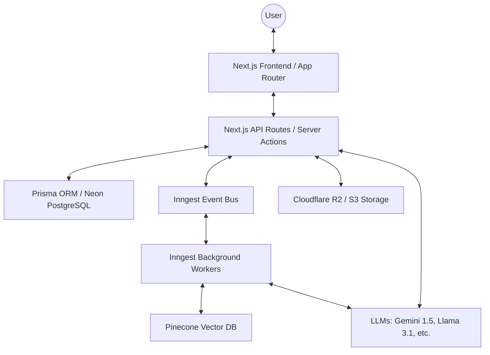
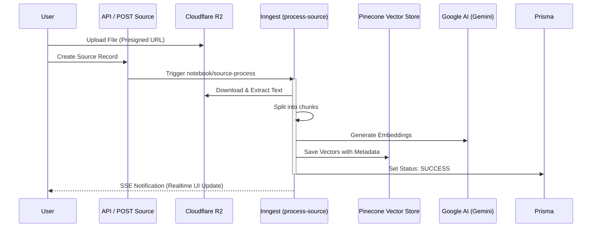
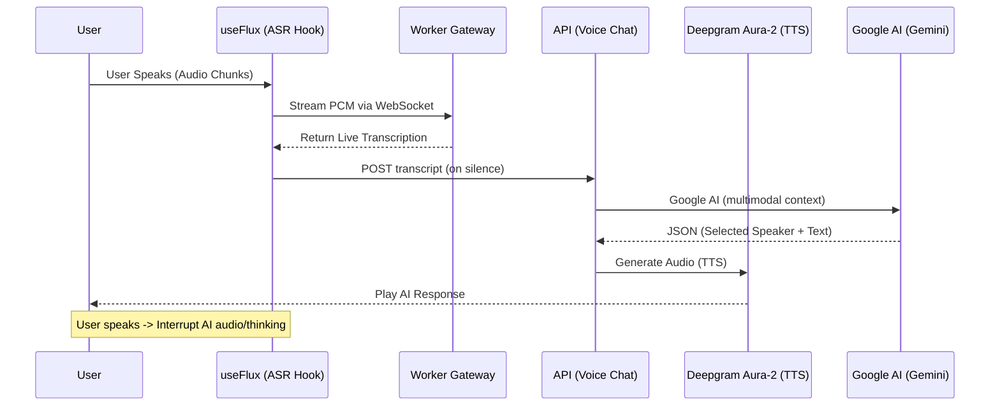

# Infera Notebook · Architecture

This document outlines the technical architecture of Infera Notebook, explaining how we handle sourcing, AI processing, and interactive real-time experiences.

---

## 🏗️ System Overview

Infera Notebook is built on a modern, event-driven serverless architecture designed for low-latency AI interactions and high-volume media processing.

---

## 📥 Sourcing & Vectorization Pipeline

When a user adds a source (PDF, URL, YouTube Video), it undergoes an automated vectorization process to enable RAG (Retrieval-Augmented Generation).

**Key Technologies:**

- **LangChain**: Used for document loading and text splitting.
- **Pinecone**: Serves as the long-term memory for notebook context.

---

## 📝 Note Generation Workflow

Notes (Mindmaps, Quizzes, FAQ, etc.) are generated asynchronously to maintain a responsive UI.

```mermaid
graph LR
    Req[User Request] --> Prisma[Create Note Record: PROCESSING]
    Prisma --> Event[Inngest: note/created]
    Event --> Context[Retrieve Context from Pinecone]
    Context --> Registry[Note UI Registry / Handlers]
    Registry --> Prompt[Centralized AIService]
    Prompt --> JSON[Structured JSON Generation]
    JSON --> Save[Save to Prisma: SUCCESS]
    Save --> UI[SSE Realtime Update]
```

**Generation Strategy:**

- Each note type has a dedicated **Handler** in `registries/note-registry.ts`.
- We use `AIService.generateObject` with strict JSON schemas to ensure reliable UI rendering.

---

## 🎙️ Interactive Voice Agent (Real-time)

The voice agent enables a low-latency, "interruptible" conversation about the notebook content using a combination of specialized models.

**Performance Optimizations:**

- **Deepgram Flux**: Specifically configured with `eot_threshold=0.7` for natural turn-taking.
- **Multimodal Context**: Uses Gemini's large context window to maintain document awareness across turns.
- **Dual-Layer Guard**: Combines `json_object` enforcement with explicit prompt instructions for reliable speaker selection.

---

## 🏛️ Storage Strategy

- **Database**: Neon (PostgreSQL) for transactional data (Users, Notebooks, Notes).
- **Blob Storage**: Cloudflare R2 for binary assets (Audio overviews, Slide images, PDF sources).
- **Public Assets**: Short-lived **Presigned URLs** are used for all media to ensure security while maintaining high performance.
